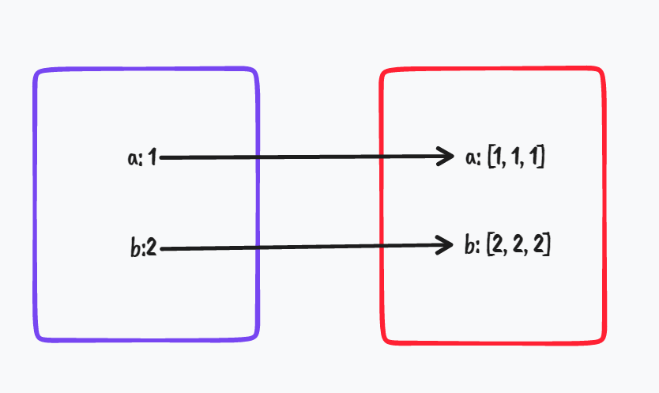
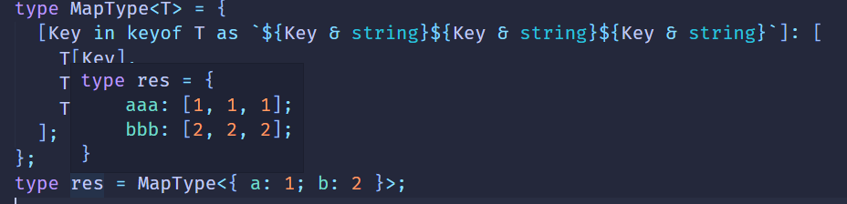

# TypeScript 类型系统中的类型

静态类型系统的目的是把类型检查从**运行时**提前到**编译时**（coding debug），TS 继承 JS 运行时的类型：

**基础类型：**number, boolean, string, object, bigint, symbol, undifined, null

**包装类型：**Number, Boolean, String, Object, Symbol

**复合类型：**class, Array

TS 在 JS 基础上又新增了三种**复合类型**: **Tuple(元组), Interface(接口), Enum(枚举)**

#### Tuple(元组)

`Tuple(元组)` 就是元素个数和类型固定的数组类型:

```ts
type Tuple = [number, string];
```

#### Interface(接口)

`Interface(接口)`就是可以描述函数、对象、构造器的结构:

对象：

```ts
interface IPerson {
  name: string;
  age: number;
}

class Person implements IPerson {
  name: string;
  age: number;
}

const personObj: IPerson = {
  name: "lcz",
  age: 18,
};
```

构造器：

```ts
interface PersonConstructor {
  new (name: string, age: number): IPerson;
}

function createPerson(ctor: PersonConstructor): IPerson {
  return new ctor("lcz", 18);
}
```

对象类型，class 类型在 TS 中也叫做索引类型，也就是索引了多个元素的类型的意思。对象可以动态添加属性，如果不知道会有什么属性，可以用索引签名:

```ts
interface IPerson {
  [prop: string]: string | number;
}

const obj: IPerson = {};
obj.name = "lcz";
obj.age = 18;
```

all and all ,**接口可以用来描述函数， 构造器，索引类型（对象，class ，数组）等复合类型**。

#### **Enum(枚举)**

enum(枚举)是一系列值的复合:

```ts
enum Transpiler {
  Babel = "babel",
  Postcss = "postcss",
  Terser = "terser",
  Prettier = "prettier",
  TypeScriptCompiler = "tsc",
}

const transpiler = Transpiler.TypeScriptCompiler;
```

此外，TS 还支持`字面量类型`,也就是类似于 1111、'abc'、{ a: 1}这种值也能作为类型

#### 字面量类型

字符串的字面量类型又两种:1,普通的字符串字面量，比如 'abc'；2.模板字面量,比如` '/${string}'`的意思就是以’/'开头,后面是任意 string 类型的字符串的字面量类型

```
function func(str: `/${string}`){

}

func('aaa'); //将会报错

func('/aaa'); // 正常
```

TS 还有四种特殊的类型: **void**, **any**, **unknown**, **never** , :

- **void**代表空，可以是 null，或者是 undifined,一般是用于不好判断的返回值；
- **any**是任意类型，任何类型都可以赋值给它，它也可以赋值给任何类型(除了 never)，因此也有人戏称 TS 为 anyScript(不是)；
- **unknown**是未知类型，任何类型都可以赋值给它，它也可以赋值给别的类型；
- **never**代表不可达，比如函数抛出异常的时候，返回值就是 never；

#### 类型的装饰

除了描述类型的结构以外，TS 的类型系统还支持描述类型的属性:

```ts
interface IPerson {
  readonly name: string;
  age?: number;
}

type tuple = [string, number?];
```

# TypeScript 类型系统中的类型运算

#### 条件类型(Contional Type)

#### extends ? :

```ts
type res = 1 extends 2 ? true : false; // type res = false
```

这就是 TS 类型系统中的 if else。

demo，上面的逻辑没啥意义，静态的值自己就能判断出来，用代码去判断显得有些冗余了。

类型运算逻辑都是用来计算一些动态的类型运算，也就是对类型的参数进行运算。(类型体操)

```ts
type isTwo<T> = T extends 2 ? true : false;

type res1 = isTwo<1>; // type res1 = false;
type res2 = isTwo<2>; // type res2 = true;
```

这种类型也叫做`高级类型`

**高级类型的特点是传入类型参数，经过一系列类型运算逻辑后，返回新的类型。**

那么如何提取类型的一部分呢？`infer`

#### infer(推导)

比如提取元组类型的第一个元素：

```ts
type FirstType<Tuple extends unknown[]> = Tuple extends [infer T,...infer R] ? T : never;
type res = FirstType[<1, 2, 3>]; // type res = 1;
```

这里的第一个 extends 并不是条件类型，条件类型是`extends ? :`,这里的 extends 是约束的意思，也就是约束了类型参数只能是数组类型；

因为不知道具体的数组元素的类型所以用 unknown。

#### |(联合)

联合类型(Union)类似与 js 里的或运算符|，但是作用于类型，代表的可以是几个类型之一。

```ts
type Union = 1 | 2 | 3;
```

#### &(交叉)

交叉类型(Intersection)类似于 js 中的与运算符&，但是作用于类型，代表对类型做合并。

```ts
type ObjType = { a: number } & { c: boolean };

type res = { a: number } & { c: boolean } extends ObjType ? true : false;
```

**Notes：**只有同一类型可以做合并，不同的类型做合并会被舍弃：

```ts
type res = "111" & "222"; // type res = never
```

#### 映射类型

对象、class 在 TS 对应的类型是索引类型(index type),那么如何对索引类型作修改呢？

```ts
type MapType<T> = {
  [Key in keyof T]: T[Key];
};
```

- **keyof T** 是查询索引类型中所有的索引，叫做`索引查询`。
- **T[Key]**是取索引类型中某个索引的值，叫做`索引访问`。
- **in** 是用于遍历联合类型的运算符

比如我们把一个索引类型的值变成三个元素的数组:

```ts
type MapType<T> = {
   [Key in keyof T]: [T[key], T[key], T[key]]
}
type = type MapType<{a:1 ,b: 2}>;// type res = {a: [1, 1, 1]; b: [2, 2, 2]}
```

**映射类型相当于把一个集合映射到另一个集合，这就是它的名字的由来。**



除了值可以变化,索引也可以变化,用 as 运算符，叫做`重映射`。

```
type MapType<T> = {
    [
        Key in keyof T
            as `${Key & string}${Key & string}${Key & string}`
    ]: [T[Key], T[Key], T[Key]]
}
```

我们用 as 把索引值也做了修改，变成了 3 个 key 重复。

```ts
type res = MapType<{ a: 1; b: 2 }>;
// type res = { aaa: [1, 1, 1];bbb: [2, 2, 2];}
```



**Notes**：这里的 &String 的意思是:

索引类型(对象、class 等)可以用 string 、number 和 symbol 作为 key，这里的 keyof T 取出的索引就是`string|number|symbol`的联合类型,和 string 交叉过后就只剩下 string 了，就像之前所说的，交叉类型会把同一类型做合并，不同类型做舍弃。
