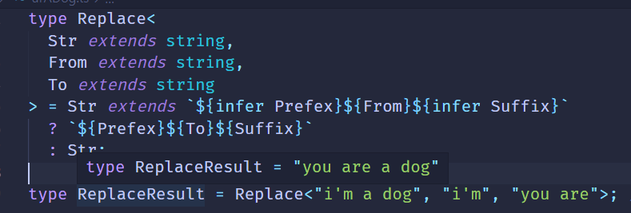
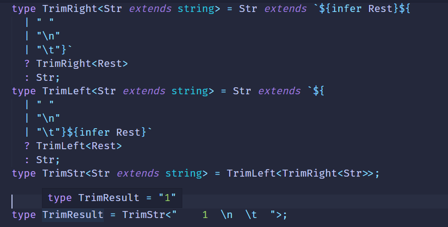

# 模式匹配做提取

#### 模式匹配

我们知道，字符串可以跟正则做模式匹配，找到匹配的部分，提取子组，之后可以用索引值等去引用匹配的子组。

```js
'abc'.replace(/a(b)c/,'$1,$1,$1') // 'b, b, b'
```

TS的类型同样可以做模式匹配

example，这样一个promise类型

```ts
type p = Promise<'lcz'>
```

我们想要提取value的类型，可以这样做

```ts
type GetValueType = P extends Promise<infer Value> ? Value : never;
```

通过extends 对传入的类型参数P做模式匹配，其中值的类型是需要提取的，我们infer一个局部变量Value来保存，如果匹配成功则返回Value，没匹配成功返回never

```ts
type getValueResult = GetValueType<Promise<'lcz'>>;// type getValueResult = 'lcz';
```

这就是TS的模式匹配：

**TS类型的模式匹配是通过extends对类型参数进行匹配，结果保存到通过infer声明的局部类型变量里面，如果匹配成功救恩那个从该局部变量拿到提取出的类型。**

#### 数组类型

##### First

数组类型想要提取一个元素的类型怎么做呢？

```ts
type arr = [1, 2, 3];
```

用它来匹配一个模式类型，提取第一个元素的类型到通过infer声明的局部变量里返回。

```ts
type GetFirst<Arr extends unknown[]> = 
    Arr extends [infer First,...unknown[]] ? Frist : never;
```

类型参数Arr通过extends约束为只能是数组类型，数组元素是unknown也就是可以是任何值。

------

**any和unknown的区别：**any和unknown都可以代表任何类型，但是unknown只能接受任意类型的值，any除了可以接受还可以赋值给任意类型（除了never）。类型体操中经常用unknown接受和匹配任何类型，而很少吧任意类型赋值给某个类型变量。

------

```ts
type GetFirstResult = GetFirst<[1, 2, 3]>;//type GetFirstResult = 1;
```

当类型参数Arr为[]时:

```ts
type GetFirstResult = GetFirst<[]>; // type GetFirstResult = never;
```

##### Last

同理Last也能这样处理

```ts
type GetLast<Arr extends unknown[]> = 
    Arr extends [...unknown[],infer Last] ? Last : never;
type GetLastResult = GetLast<[1, 2, 3]>; // type GetLastResult = 3;
```

##### PopArr

我们分别取了首尾元素，当然也可以取剩余元素，放到infer声明的Rest变量中

```ts
type PopArr<extends unknown[]> = 
    Arr extends [] ? [] 
       : Arr extends [...infer Rest, unknown] ? Rest : never;
type GetPopResult = PopArr<[1, 2, 3]> // type GetPopResult = [1, 2]
```

##### ShiftArr

同理我们也能做shift操作

```ts
type ShiftArr<extends unknown[]> = 
    Arr extends [] ? []
        : Arr extends [unknown, ...infer Rest] ? Rest : never;
type GetShiftResult = ShiftArr<[1, 2, 3]> // type GetShiftResult = [2, 3]
```

#### 字符串类型

字符串类型同样可以做模式匹配，匹配一个字符串，把需要提取的部分放到infer声明的局部变量里。

##### StartsWith

判断字符串是否以某个前缀开头，也是通过模式匹配：

```ts
type StartWith<Str extends string, Prefix extends string> = 
    extends `${Prefix}${string}` ? true : false;
type isLStart = StartsWtih<'LCZ', 'L'>;// true
```

##### Replace

同理可以实现字符串的替换



##### Trim

同理trim操作也能实现



#### 函数

函数同样可以通过模式匹配来提取参数的类型:

##### GetParameters

```ts
type GetParameters<Func extends Function> = 
    Func extends (...args: infer Args) => unknown ? Args : never;
```

类型参数Func时要匹配的函数类型，通过extends 约束为 Function

Func和模式类型做匹配，参数类型放到用infer声明的局部变量Args里，返回值可以是任何类型unkonw。

返回提取到的参数类型Args

```ts
type ParametersResult = GetParameters<(name: string, age:number) => string>
// type ParametersResult = [name: string, age: number]
```

##### GetReturnType

能提取参数类型，同样可以提取返回值类型；

```ts
type GetReturnType<Func extends Function> = 
     Func extends (...args: any[]) => infer ReturnType ? ReturnType : never;
```

**Notes**:这里args的值不能是unknown，因为参数类型要赋值给别的类型，而unknown只能用来接收类型

```
type ReturnTypeResult = GetReturnType<()=> 'lcz'> // type ReturnTypeResult = 'lcz';
```

##### GetThisParameterType

方法里可以调用this

```ts
class Person{
    name:string;
    helloMsg:string;
    constructor() {
        this.name = "Dog";
        this.helloMsg = 'wang~wang~,i\'m ';
    }
    
    hello(){
        return this.helloMsg + this.name;
    }
}

const dog = new Person();
dog.hello(); // 'wang~wang~,i'm Dog'
```

用`对象.方法名`的方式调用的时候，this就指向那个对象。

当时方法也可以用call或者apply调用改变this指向。

```ts
class Person{
    name:string;
    helloMsg:string;
    constructor() {
        this.name = "Dog";
        this.helloMsg = 'wang~wang~,i\'m ';
    }
    
    hello(){
        return this.helloMsg + this.name;
    }
}

const dog = new Person();
dog.hello.call({name:'Cat', helloMsg: 'miao~miao~,i\'m '}); // 'miao~miao~,i'm Cat'
```

call 调用的时候this的指向就变了，怎么让编译器知道我们的this指向的类型错误呢？

```ts
class Person{
    name:string;
    helloMsg:string;
    constructor() {
        this.name = "Dog";
        this.helloMsg = 'wang~wang~,i\'m ';
    }
    
    hello(this: person){
        return this.helloMsg + this.name;
    }
}

const dog = new Person();
dog.hello.call({name:1, helloMsg: 'miao~miao~,i\'m '}); // should throw type error
```

这里的this类型同样也可以通过模式匹配提取出来：

```ts
type GetThisParameterType<T> = T extends (
  this: infer ThisType,
  ...args: any[]
) => any
  ? ThisType
  : unknown;
type GetThisParameterResult = GetThisParameterType<typeof dog.hello>;
```

类型T是待处理的类型；

用T匹配一个模式类型，提取this的类型到infer声明的局部变量ThisType中,其余的参数是任意类型也就是any，返回值也是any类型。

#### 构造器

构造器和函数的区别是，构造器适用于创建对象的，所以可以被new。

同样，我们也可以通过模式匹配提取构造器的参数和返回值的类型：

##### GetInstanceType

构造器类型可以用interface声明，使用new():xx的语法

```ts
interface Person{
   name:string
}
interface PersonConstructor{
   new(name:string):Person
}
```

这里的PersonConstructor返回的是Person类型的实例对象，这个也可以通过模式匹配取出来。

```ts
type GetInstanceType<
   ConstructorType extends new (...args: any) => any
> = ConstructorType extends new(...args: any) = infer InstanceType ? InstanceType : any
```

类型参数ConstructorType 匹配一个模式类型，提取返回后的实例类型到infer声明的局部变量InstanceType里，返回InstanceType。

这样就饿能去除构造器对应的实例类型：

```ts
type GetInstanceTypeResult  = GetInstanceType<PersonConstructor> // type GetInstanceTypeResult = Person
```

##### GetConstructorParameters

同样也可也提取构造器的参数类型：

```ts
type GetConstructorParameters<
    ConstructorType extends new (...args: any) => any
> = ConstructorType extends new (...args: infer ParametersType) => any
    ? ParameterType
    : never;
type GetConstructorParametersResult = GetConstructorParameters<PersonConstructor>;
```

#### 索引类型

索引类型同样也可以用匹配模式提取某个索引的值的类型，比如React的index.d.ts里PropsWithRef的高级类型，就是通过匹配模式提取了ref的值的类型，简化如下：

##### GetRefProps

```ts
type GetRefProps<Props> = 
     'ref' extends keyof Props ?
         Props extends { ref?: infer Value | undefined}
               ? Value
               : never
            : never
```

类型参数Props为待处理的类型。

通过keyof Props 取出Props里所有索引构成的联合类型，判断下ref是否在其中也就是‘ref extends keyof Props

为什么要做这个判断，注释中写到

```ts
// need to check first if 'ref' is a valid prop for ts@3.0
// otherwise it will infer '{}' instead of 'never'
```

在ts3.0里如果没有对应的索引，Obj[key]返回的是{}而不是never。

```ts
type GetRefPropsResult =  GetRefProps<{ref?:1, name:'lcz'}> // type GetRefPropsResult = 'lcz'
```

当ref为undefined：

```ts
type GetRefPropsResult =  GetRefProps<{ref?:undefined, name:'lcz'}> // type GetRefPropsResult = undefined
```

