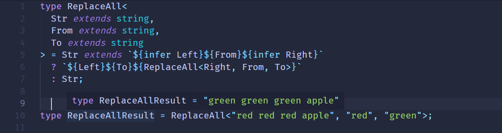
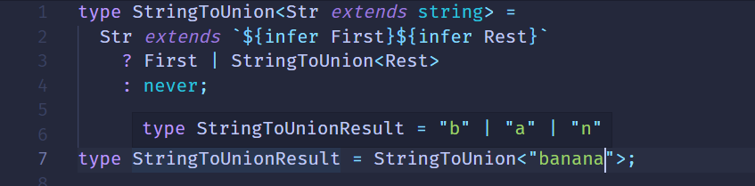
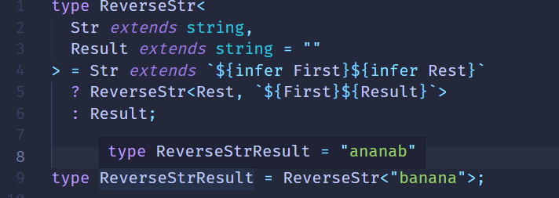
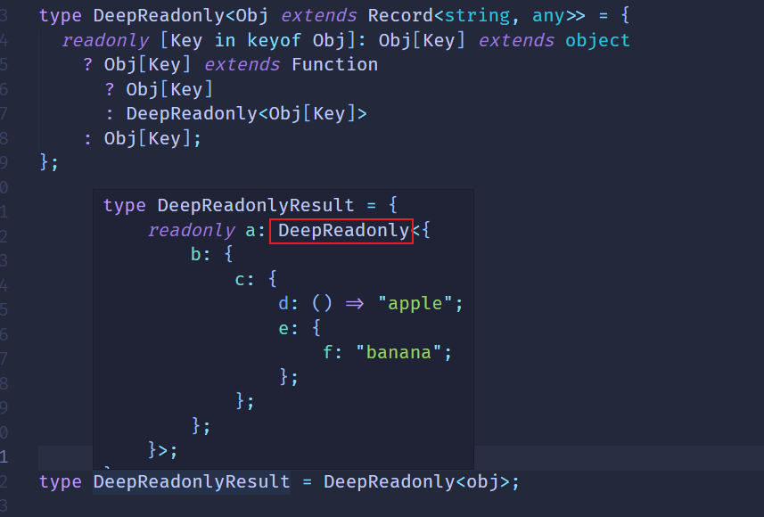
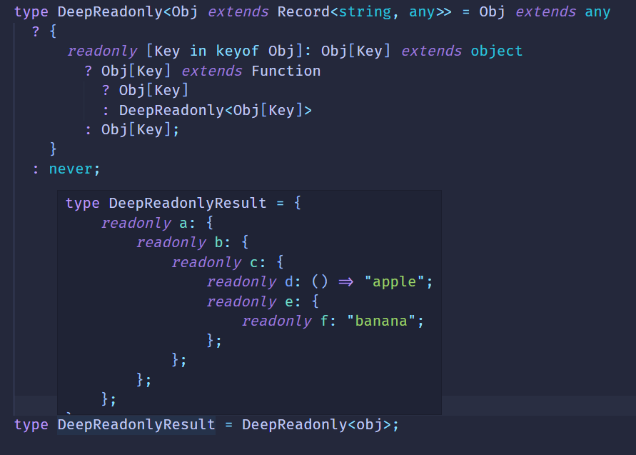

# 递归复用做循环

会做类型的提取和构造之后，我们已经可以写出很多类型变成逻辑了，但是有时候提取或构造的数组元素个数不确定、对象层数不确定。这时候怎么办呢？

前面的案例已经涉及了一些，就是递归。

这就是类型体操的第三个套路：递归复用做循环。

#### 递归复用

**递归是吧问题分解为一系列相似的小问题，通过函数不断调用自身来解决这一个个小问题，知道满足条件，就完成了对问题的求解。**

TypeScript的高级类型支持类型参数，可以做各种类型运算逻辑，返回新的类型，和函数调用对应的，自然也支持递归。

**TS类型系统不支持循环但是支持递归。当处理数量（个数、长度、层数）不固定的类型的时候，可以只处理一个类型，然后递归的戴奥用自身处理下一个类型，直到结束条件也就是所有的类型都处理完了，就完成了不确定数量的类型编程，达到循环的效果。**

既然提到了数组、字符串、对象等类型，那么可以看一下这些类型的递归案例。

#### Promise的递归调

##### DeepPromiseValueType

先用Promise热热身，实现一个提取不确定层数的Promise中的value类型的高级类型。

```ts
type ttt = Promise<Promise<Promise<Record<string, any>>>>
```

这里是3层Promise，value类型是索引类型。

数量不确定，一涉及到这个就要想到用递归去做，每次只处理一层的提取，然后剩下的到下次递归去做，知道条件结束。

所以高级类型是这样的：

```ts
type DeepPromiseValueType<P extends Promise<unknown>>=
     P extends Promise<infer ValueType>
       ? ValueType extends Promise<unknown>
         ? DeepPromiseValueType<ValueType>
         : ValueType
       : never;
```

类型参数P是待处理的Promise，通过extends约束为Promise类型，value类型不确定，设为unknown。

每次只处理一个类型的提取，也就是通过模式匹配提取出value类型到infer申明的ValueType中。

然后判断如果ValueType 依然是一个Promise类型，就递归处理。

结束条件就是ValueType不为Promise类型，那就处理完成所有的层数，返回这时候的ValueType。

这样我们就提取到了最里层的Promise的value类型，也就是索引类型：

```ts
type DeepPromiseValueTypeResult = DeepPromiseValueType<Promise<Promise<Promise<Record<string, any>>>>>;
// type DeepPromiseValueTypeResult = { [x: string]: any };
```

这里可以做一点简化：不再约束类型参数必须是Promise，这样就可以少一层判断。

```ts
type DeepPromiseValueType<T>=
     T extends Promise<infer ValueType>
       ? DeepPromiseValueType<ValueType>
       : T
```

#### 数组的递归复用

##### ReverseArr

有这样一个元组类型：

```ts
type arr = [1, 2, 3, 4, 5];
```

我们把它反过来，也就是变成：

```ts
type arr = [5, 4, 3, 2, 1];
```

```ts
type ReverseArr<Arr extends unknown[]> = 
     Arr extends [infer One, infer Two, infer Three, infer Four, infer Five]
         ? [Five, Four, Three, Two, One]
         : never;
```

如果数字长度不确定呢？

数量不确定就要想到递归

```ts
type ReverseArr<Arr extends unknown[]> = 
     Arr extends [infer First,...infer Rest]
         ? [...ReverseArr<Rest>, First]
         : Arr;
type ReverseArrResult = ReverseArr<[1, 2, 3, 4, 5]>;
// type ReverseArrResult = [5, 4, 3, 2, 1]
```

参数类型Arr为待处理的数组类型，元素类型不确定，unknown。

每次只处理一个元素的提取，放到Infer声明的局部变量First里，剩下的放到Rest里。

用First作为最后一个元素构造新数组，其余元素递归取。

结束条件就是取完所有的元素，也就是不满足模式匹配的条件，这时候返回Arr.

##### Includes

既然递归可以做循环用，那么像查找元素这种自然也可以实现。

比如查找元素[1, 2, 3, 4, 5]中是否存在3，是就是返回true，否则返回false。

从长度不不固定的数组中查找某个元素，自然想到递归

```ts
type Includes<Arr extends unknown[], FindItem> = 
     Arr extends [infer First,...infer Rest]
     ?  IsEqual<First, FindItem> extends true
        ? true
        : Includes<Rest, FindItem>
     : false;
type IsEqual<A,B> = (A extends B ? true : false) & (B extends A ? true : false);

type IncludesResult = Includes<[1, 2, 3, 4, 5], 3>;
// type IncludesResult = true
```

判断两个元素是否相等，就是A是B的子类型，B是A的子类型。

##### RemoveItem

既然能查找，也就能删除，只需要改一下返回结果，构造一个新的数组返回。

```ts
type RemoveItem<Arr extends unknown[],RemoveItem, RemoveResult extends unknown = []> =
     Arr extends [infer First, ...infer Rest]
        ?  IsEqual<First, RemoveItem> extends true
           ? RemoveItem<Rest, RemoveItem, Result>
           : RemoveItem<Rest, RemoveItem,[...Result, First]>
        ? Reulst;
         
type IsEqual<A,B> = (A extends B ? true : false) & (B extends A ? true : false);
type RemoveItemResult = RemoveItem<[1, 2, 3, 4, 5], 3>
// type RemoveItemResult = [1, 2, 4, 5]
```

##### BuildArray

递归调用实现一个构造数组，比如传入5，跟元素类型，构造一个长度为5的该元素类型构成的数组。

```ts
type BuildArray<Length extends number,Ele = unknown, Arr extends unknown[]> =
    Arr['Length'] extends Length
    ? Arr
    : BuildArray<Length, Ele, [...Arr, Ele]>;
```

`Arr['Length']`在TS里表示该数组的长度，如果`Arr['Length'] extends Length`则说明已经构造完成，不需要在进行递归操作。

#### 字符串类型的递归

##### ReplaceAll

学习模式匹配的时候，我们实现过一个Replace的高级类型：


它能把一个字符串中某个字符替换成另一个。但是如果有多种这个字符就无法处理了。

借用递归复用的思想我们可以实现一个ReplaceAll




##### StringToUnion

我们想把字符串中每个字符单独提取出来组合成联合类型




**Notes**：注意Union类型中每种类型只会出现一次，所以`type StringToUnionResult = "b" | "a" | "n"`而不是 

`"b" | "a" | "n" | "a" | "n" | "a"`

##### ReverseStr

我们实现了数组的反转自然也可以实现字符串的反转




#### 对象类型的递归

对象类型的递归，也可以叫做索引类型的递归。

我们之前实现了索引类型的映射，给索引加上了readonly修饰符

```ts
type ToReadonly<T> = {
    readonly [Key in keyof T]: T[Key]
}
```

如果索引类型的层级不确定呢？

比如这样：

```ts
type Obj = {
   a:{
       b:{
           c:{
               d:()=> 'apple',
               e:{
                   f:'banana'
               }
           }
       }
   }
}
```

**层数不确定，就要想到递归**

##### DeepReadonly

```ts
type DeepReadonly<Obj extends Record<string, any>> = {
  readonly [Key in keyof Obj]: Obj[Key] extends object
    ? Obj[Key] extends Function
      ? Obj[Key]
      : DeepReadonly<Obj[Key]>
    : Obj[Key];
};
```

类型参数Obj是待处理的索引类型，约束为`Record<string: any>`,也就是索引为string，值为任意类型的索引类型。

索引映射之前的索引，`[Key in keyof Obj]`,加上readonly修饰。

值要做下判断，如果Obj[Key]是object类型但不是Function，就进行递归处理`DeepReadonly<Obj[Key]>`

否则，值不是object就直接返回之前的Obj[Key]![deepReadonly1](../img/deepReadonly1.png



为什么这里没有计算呢？

因为TS只有类型在被用到的时候才会做类型计算。

所以可以在前端加上一段`Obj extends never ? never : {xxx}` 或者 `Obj extends any ? {xxx} : never`等，让它触发计算。



而且写`Obj extends any ? {xxx} : never`还有额外的好处，就是可以处理联合类型Union