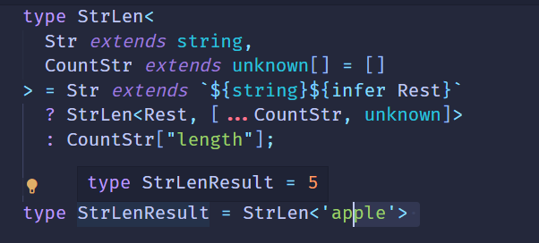
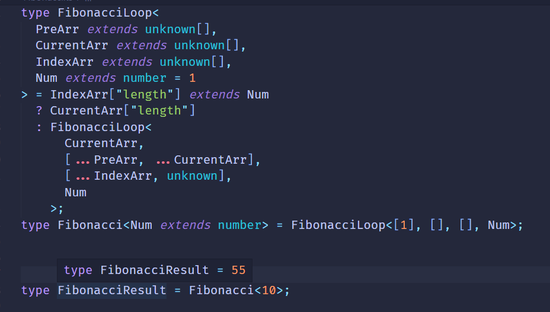

# 数组长度做计数

TS类型系统不是图灵完备，各种逻辑都能写么，但好像没有发现数值相关的逻辑。

TS类型系统没有加减乘除运算符，怎么做数值运算呢？

前面我们实现`BuildArray`时取过一个数组的长度：

```ts
type BuildArray<Length extends number,Ele = unknown, Arr extends unknown[]> =
    Arr['length'] extends Length
    ? Arr
    : BuildArray<Length, Ele, [...Arr, Ele]>;
```

而数组类型我们时可以构造出来的，那么通过构造不同长度的数组然后取lenth，不就是数值的运算么？

**TS类型系统中没有加减乘除运算符，但是可以通过构造不同的数组然后取length的方式来完成数值计算，把数值的加减乘除转化为对数组的提取和构造。**（严格来说是元组）

这点是类型体操中最麻烦的一个点。

#### 数组长度实现加减乘除

##### Add

我们知道了数值计算要转换为对数组类型的操作，那么假发的实现很容易想到：

构造两个数组，然后合并成一个，取`length`。结合上面的`buildArray`我们就可以构造成出一个合并的数组，取他的长度

```ts
type Add<Num1 extends number, Num2 extends number> = 
     [...BuildArray<Num1>, ...BuildArray<Num2>]['length'];
type AddResult = Add<22, 33>;
// type AddResult = 55;
```

##### Subtract

假发是构造数组，减法怎么做呢？

减法是从数值中去掉一部分，可以结合数组类型的提取来做

```ts
type Subtract<Num1 extends number, Num2 extends number>= 
     BuildArray<Num1> extends [...arr1:BuildArray<Num2>, ...arr2: infer Rest]
          ? Rest['length']
          : never;
type SubtractResult = Subtract<66, 22>;
// type SubtractResult = 44;
```

类型参数Num1，Num2分别是被减数与减数，通过extends约束为number。

构造Num1长度的数组，通过类型提取Num2长度个元素，剩下的元素放到infer声明的Rest里面。

取Rest长度返回就是减法的结果。

##### Multiply

我们实现了加法跟减法，乘法我们可以用递归 配合加减法来做。

```ts
type Multiply<Num1 extends number, Num2 extends number, ResultArr extends unknown[]> = 
    Num2 extends 0 ? ResultArr['length']
                   : Multiply<Num1, Subtract<Num2, 1>, [...ResultArr]>;
type MultiplyResult = Multiply<2, 3>; // type MultiplyResult = 6
```

##### Divide

乘法是递归的累加，那除法不就是递归的累减么？

```ts
type Divide< Num1 extends number, Num2 extends number, CountArr extends [] = []> =
      Num1 extends 0 ? CountArr['length']
                     : Divide<Subtract<Num1, Num2>, Num2, [unknown, ...CountArr]>;
type DivideResult = Divede<9, 3>;
// type DivideResult = 3
```

#### 数组长度实现计数

##### StrLen

数组长度可以通过length来得到，但是祖父穿类型不能取length

字符串长度不确定，显然要用到递归。每次取一个数，知道取完，就是字符串的长度。



##### GreaterThan

能够做计数了就能做两个数值的比较

我们往一个数组里面不断放入元素，取长度，如果先到A就是B大，否则是A大。

```ts
type GreaterThan<Num1 extends number, Num2 extends number, CountArr extends unknown[] = []> = 
    Num1 extends Num2 
        ? false
        : CountArr['length'] extends Num2
             ? true
             : CountArr['length'] extends Num1
                  ? false
                  : GreaterThan<Num1, Num2, [...CountArr, unknown]>;
type GreaterThanResult = GreaterThan<3, 4> //  type GreaterThanResult = false       
```

##### Fibonacci

谈到了数值运算，不得不提起经典的Fibonacci数列的计算。

**Fibonacci** ：1、1、2、3、5、8、13、21、32...前两数之和等于第三数这样规律的数列。

F(0) = 1,F(1) = 1, F(n) = F(n - 1) + F(n - 2) (n >= 2 , n∈N*)

也就是递归的加法，我们用TS类型编程里的构造数组来实现这种加法：




`PreArr`为之前累加的数组，`CurrentArr`是当前累加的数组，`IndexArr`为计数数组，参数`Num`为第几个Fibonacci数。

判断当前`IndexArr`是否到了`Num`，到了就返回当前累加的数组的长度`CurrentArr['length']`。

否则就递归调用传入 `CurrentArr` 为下一次递归的`PreArr`， `[...PreArr, ...CurrentArr]`为下一次递归的`CurrentArr`，`IndexArr`塞入一个unknown，表示计数+1， `Num`继续传入下一次递归作为`Num`。

