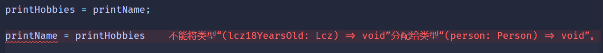
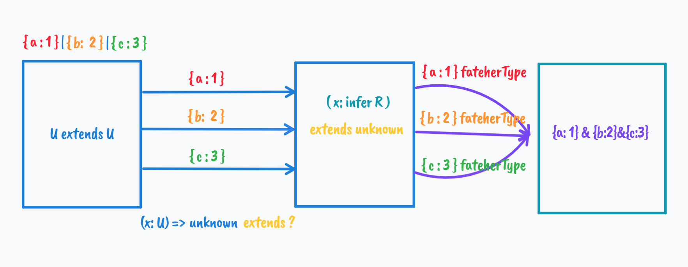

# 原理篇：逆变、协变、双向协变、不变

深入学习TS类型系统的话、逆变、协变、双向协变、不变是绕不开的概念。

这些概念看起来高大上，实际上并不复杂。

#### 类型安全和型变

TS给添加了一套类型系统，是为了保证类型安全的，也就是保证变量只能赋值给同类型的值，对象只能访问它有的属性跟方法。

比如number类型就不能赋值给Boolean类型的变量，Date类型的对象就不能使用exec方法。

这是类型检查做的事，遇到安全问题会在编译时报错。

但是这种类型安全的限制也不能太死板，有的时候需要做一些变通，比如子类型是可以赋值给父类型的变量的，可以完全当成父类型来使用，也就是“型变”（类型改变）。

这种“型变”分为两种，一种是子类型可以赋值给父类型，叫做**协变**，一种是父类型可以赋值给子类型，就是**逆变**。

先来看下协变：

协变是很好理解的，

##### 协变

```ts
interface Person{
   name: string;
   age: number;
}

interface Lcz{
    name: string;
    age: number;
    hobbies: string[]
}
```

Lcz就是Person的子类型，这里Lcz就可以赋值给Person：

```ts
let person: Person = {
    name: '',
    age: 0
}

let lcz18YearsOld: Lcz = {
    name:'lcz',
    age:18,
    hobbies:['coding', 'sleeping', 'Gaming']
}

person = lcz18YearsOld;
```

这并不会报错，虽然这两类型不一样，但是依然是类型安全的.

很容易理解： 类型系统如果子类型不能赋值给父类型，还叫父子类型么。

##### 逆变

```ts
let printHobbies:(lcz18YearsOld: Lcz)=> void;

printHobbies = (lcz18YearsOld) => {
    console.log(lcz18YearsOld.hobbies);
}

let printName:(person: Person) => void;

printName = (person) => {
    console.log(person.name);
}
```

`printHobbies`的参数 `Lcz` 是 `printName` 的参数`Person`的子类型。

`printName `能赋值给 `printHobbies么`？ `printHobbies` 能赋值给 `printName`么？

 

`printName`的参数`Person`不是`printHobbies`的参数`Lcz`的父类型么，为什么能赋值给子类型？

因为`printName`函数调用的时候是按照`printHobbies`的`Lcz`约束的类型，但实际上函数只用到了父类型Person的属性和方法，当然不会有问题。

这就是**逆变**，函数的参数有逆变的性质(而返回值是协变的，也就是子类型可以赋值给父类型)

但是`printName ` 使用`Person`来约束类型，但是调用的时候却按照`Lcz`来访问属性和方法，那自然不安全了，所以就会报错。

但是在TS 2.x之前支持这种赋值，也就是父类型可以赋值给子类型，子类型可以赋值给父类型，既**逆变**又**协变**，叫做**双向协变**。

这明显是有问题的，不能保证类型安全，所以之后TS交了一个编译选项`strictFunctionTypes`,设置为true就只支持函数参数的**逆变**,

设置为false则是双向协变。

在类型编程中这种逆变性质有什么用呢？

在联合转交叉的实现中

```ts
type UnionToIntersection<U> =
     (U extends U ? (x: U) => unknown : never) extends (x: infer R) => unknown : never
         ? R
         : never
```

`U extends U`为了触发联合类型的distributive的性质，让每个类型单独传入做计算，最后合并。

利用U作为参数构造个函数，通过模式匹配取参数类型，三种共同约束R的父类型。

结果就是交叉类型。



##### 不变

非父子类型之间不会发生形变，只要类型不一样就会报错：

```ts
interface Animal {
  name: string;
  hasTail: boolean;
}
let Dog: Animal = {
  name: "xiaohuang",
  hasTail: true,
};

lcz18YearsOld = Dog; // 报错 类型“Animal”缺少类型“Lcz”中的以下属性: age, hobbiests(2739)
```

那类型之间的父子关系怎么确定的呢，好像也没有看到extends的继承？

##### 类型父子关系的判断

像JAVA里面的类型都是通过extends继承的，如果 `A extends B`，那么A就是B的子类型。这种叫做**名义类型系统（nominal type）**

(名义上的父亲,你的干爹也是你的爹)

就那前面的例子来说：

```ts
interface Person {
  name: string;
  age: number;
}

interface Lcz {
  name: string;
  age: number;
  hobbies: string[];
}

let person: Person = {
  name: "",
  age: 0,
};

let lcz18YearsOld: Lcz = {
  name: "lcz",
  age: 18,
  hobbies: ["coding", "sleeping", "Gaming"],
};
```

Lcz 和 Person有 `extends` 关系么?

没有啊

那是怎么确定父子关系的？

通过结构，更具体的那个是子类型，这里的Lcz有Person的所有必要属性，并且还有一些充分属性，所以Lcz是Person的子类型。

注意这里是更具体，而不是更多

判断联合类型父子关系的时候，`'a'| 'b'`跟  ` 'a'| 'b'| 'c'`哪个更具体，显然是 `'a' | 'b'`，所以`'a' | 'b'`是 

`'a' | 'b'| 'c'`的子类型。

```ts
type res = 'a' | 'b' extends 'a' | 'b' | 'c' ? true : false;
// type res = true
```

