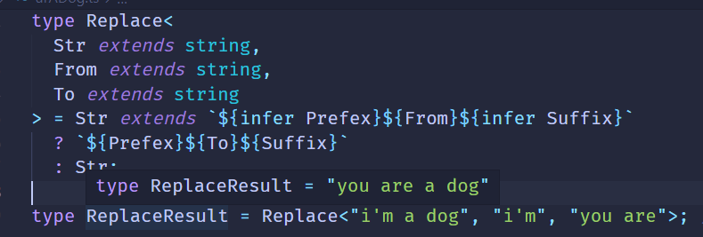
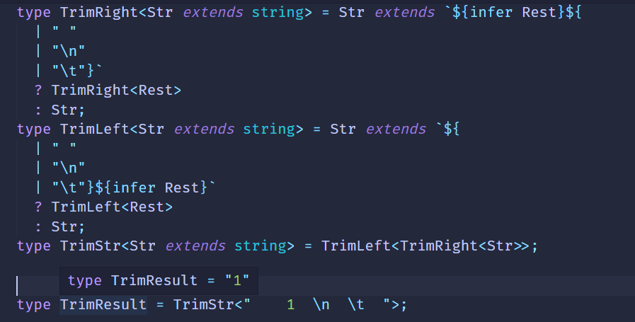

# 模式匹配做提取

#### 模式匹配

我们知道，字符串可以跟正则做模式匹配，找到匹配的部分，提取子组，之后可以用索引值等去引用匹配的子组。

```js
'abc'.replace(/a(b)c/,'$1,$1,$1') // 'b, b, b'
```

TS的类型同样可以做模式匹配

example，这样一个promise类型

```ts
type p = Promise<'lcz'>
```

我们想要提取value的类型，可以这样做

```ts
type GetValueType = P extends Promise<infer Value> ? Value : never;
```

通过extends 对传入的类型参数P做模式匹配，其中值的类型是需要提取的，我们infer一个局部变量Value来保存，如果匹配成功则返回Value，没匹配成功返回never

```ts
type getValueResult = GetValueType<Promise<'lcz'>>;// type getValueResult = 'lcz';
```

这就是TS的模式匹配：

**TS类型的模式匹配是通过extends对类型参数进行匹配，结果保存到通过infer声明的局部类型变量里面，如果匹配成功救恩那个从该局部变量拿到提取出的类型。**

#### 数组类型

##### First

数组类型想要提取一个元素的类型怎么做呢？

```ts
type arr = [1, 2, 3];
```

用它来匹配一个模式类型，提取第一个元素的类型到通过infer声明的局部变量里返回。

```ts
type GetFirst<Arr extends unknown[]> = 
    Arr extends [infer First,...unknown[]] ? Frist : never;
```

类型参数Arr通过extends约束为只能是数组类型，数组元素是unknown也就是可以是任何值。

------

**any和unknown的区别：**any和unknown都可以代表任何类型，但是unknown只能接受任意类型的值，any除了可以接受还可以赋值给任意类型（除了never）。类型体操中经常用unknown接受和匹配任何类型，而很少吧任意类型赋值给某个类型变量。

------

```ts
type GetFirstResult = GetFirst<[1, 2, 3]>;//type GetFirstResult = 1;
```

当类型参数Arr为[]时:

```ts
type GetFirstResult = GetFirst<[]>; // type GetFirstResult = never;
```

##### Last

同理Last也能这样处理

```ts
type GetLast<Arr extends unknown[]> = 
    Arr extends [...unknown[],infer Last] ? Last : never;
type GetLastResult = GetLast<[1, 2, 3]>; // type GetLastResult = 3;
```

##### PopArr

我们分别取了首尾元素，当然也可以取剩余元素，放到infer声明的Rest变量中

```ts
type PopArr<extends unknown[]> = 
    Arr extends [] ? [] 
       : Arr extends [...infer Rest, unknown] ? Rest : never;
type GetPopResult = PopArr<[1, 2, 3]> // type GetPopResult = [1, 2]
```

##### ShiftArr

同理我们也能做shift操作

```ts
type ShiftArr<extends unknown[]> = 
    Arr extends [] ? []
        : Arr extends [unknown, ...infer Rest] ? Rest : never;
type GetShiftResult = ShiftArr<[1, 2, 3]> // type GetShiftResult = [2, 3]
```

#### 字符串类型

字符串类型同样可以做模式匹配，匹配一个字符串，把需要提取的部分放到infer声明的局部变量里。

##### StartsWith

判断字符串是否以某个前缀开头，也是通过模式匹配：

```ts
type StartWith<Str extends string, Prefix extends string> = 
    extends `${Prefix}${string}` ? true : false;
type isLStart = StartsWtih<'LCZ', 'L'>;// true
```

##### Replace

同理可以实现字符串的替换



##### Trim

同理trim操作也能实现

