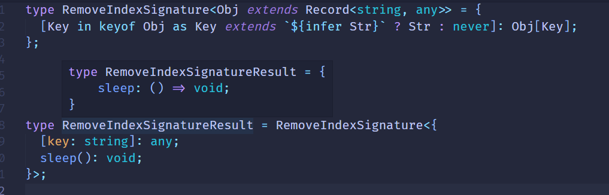

# 特殊特性要记清

我们学会了提取、构造、递归、数组长度计数、联合类型分散之后，各种类型体操都能写了，不过有些类型比较特殊，要专门记一下。

#### 特殊类型的特性

TS类型系统中有些类型比较特殊，比如any、never、联合类型，比如class有public、protected、private属性，比如索引类型有具体的索引和可索引签名，索引还有可选和非可选。

如果给我们一中类型让我们判断是什么类型，应该怎么做呢？

**类型的判断要根据它的特性来，比如判断联合类型就要根据它的distributive的特性**

##### IsAny

如何判断一个类型是any类型呢？要根据它的特性来：

**any类型跟任何类型交叉都是any，也就是`1 & any` 结果是`any`**

```ts
type IsAny<T> = 'a' extends ('b' & T) ? true : false;
```

这里的`'a'`跟`'b'`可以换成任意类型。

当传入any时：

```ts
type IsAnyResult = IsAny<any>;
// type IsAnyResult = true
```

当传入其他类型时：

```ts
type IsAnyResult2 = IsAny<'a'>;
//type IsAnyResult2 = false
```

##### IsEqual

之前我们实现`IsEqual`是这样写的：

```ts
type IsEqual<A, B> = (A extends B ? true : false) &(B extends A ?  true : false);
```

问题也出在any的判断上：

因为any可以是任何类型，任何类型也都是any，所以这样写判断不出any类型来。

所以我们可以这样写：

```ts
type IsEqual2<A, B> = (<T>() => T extends A ? 1 : 2) extends (<T>()=> T extends B ? 1 : 2) ? true : false;
type IsEqual2Result = IsEqual2<'a', any>;
// type IsEqual2Result = false
```

这是因为TS对这种形式的类型做了特殊处理，是一种hack写法，他的解释要从TS源码找答案，我们暂时这样写。

##### IsUnion

还记得怎么判断union联合类型么？

```ts
type IsUnion<A ,B = A> =
     A extends A 
       ? [B] extends [A]
           ? false
           : true
     : never;        
```

##### IsNever

never在条件类型中也比较特殊，如果条件类型左边是类型参数，并且传入的是never，那么直接返回never：

```Ts
type TestNever<T> = T extends number ? 1 : 2;
```

当T为never时：

```ts
type TestNeverResult = TestNever<never>;
// type TestNeverResult = never
```

所以我们不能直接 `T extends number`来判断，可以这样

```ts
type IsNever<T> = T extends [never] ? true : false;
type IsNeverResult = IsNever<never>;
// type IsNeverResult = true;
```

除此以外any在条件类型中也比较特殊，如果类型参数为any，会直接返回`trueType`和`falseType`的合并：

```ts
type TestAny<T> = T extends number ? 1 : 2;
type TestAnyReulst = TestAny<any>;
// type TestAnyReulst = 1 | 2
```

##### IsTuple

元组怎么判断呢？它和数组有什么区别呢？

元组类型也是数组类型，但每个元素都是只读的，并且length时数字字面量，而数组的length是number

```ts
type len = [1, 2, 3]['length'];
// type len = 3
type len2 = number[]['length'];
// type len2 = number
```

我们就可以更具这两个属性来判断元组类型:

```ts
type IsTuple<T> = 
    T extends readonly [...params: infer Eles]
    ? NotEqual<Eles['length'], number>
    : false
```

- 参数类型T是要判断的类型
- 首先判断T是否是数组类型，如果不是返回false，如果是的话继续判断length是否是number
- 如果是数组并且length不是number类型，那么它就是一个元组

`NotEqual`的实现是这样的

```ts
type NotEqual<A, B> = 
    (<T>()=> T extends A ? 1 : 2) extends (<T>()=> T extends B ? 1 : 2)
    ? false
    : true
```

A是B类型，B是A类型，那么就是同一个类型，返回false，否则返回true。

当传入元组时

```ts
type IsTupleResult = IsTuple<[1, 2, 3]>;
// type IsTupleResult = true
```

当传入数组时

```ts 
type IsTupleResult2 = IsTuple<number[]>;
// type IsTupleResult2 = false;
```

##### UnionToIntersection

类型之间是有父子关系的，更具体的那个是子类型，比如`A`和`B`的交叉类型 `A & B`就是联合类型 `A | B`的子类型，因为更具体。

如果允许父类型赋值给子类型，就叫做**逆变**

如果允许子类型赋值给父类型，就叫做**协变**

在TS中有函数参数时有逆变性质的，也就是如果参数可能是多个类型，类型参数会变成他们的交叉类型。

```ts
type UnionToIntersection<U> = 
     (U extends U ? (x: U) => unknown : never) extends (x: infer R) => unknown 
     ? R 
     : never
```

- `U extends U`是为了触发联合类型的**分布式条件类型**，让每个元素单独传入做计算，最后合并。
- 利用U作为参数构造个函数，通过模式匹配取参数的类型

##### GetOptional

如何提取索引类型中的可选索引呢？

这也要利用可选索引的特性：**可选索引的值为undefined和值类型的联合类型**

```ts
type obj = {
    name:string.
    age?:number
}
```

过滤可选索引，就要构造一个新的索引类型，中间做过滤

```ts
type GetOptional<Obj extends Record<string, any>> = {
    [
        Key in keyof Obj
            as {} extends Pick<obj, Key> ? Key : never
    ] : Obj[Key];
}
```

类型参数Obj为待处理的索引类型，类型约束为索引string、值为任意类型的索引类型`Record<string, any>`

用映射类型的语法重新构造索引类型，索引是之前的索引也就是`Key in keyof Obj`，但是要做一些过滤，也就是as之后的部分。

过滤的方式就是单独取出索引后，判断空对象是否是其子类型。

这里 Pick是ts提供的内置高级类型，也就是取出某个Key构造新的索引类型：

```ts
type Pick<T, K extends keyof T> = {[P in K] : T[P]};
```

##### GetRequired

实现了`GetOptional`，那反过来就是`GetRequired`,也就是过滤了所有非可选的索引构造成新的索引类型：

```ts
type IsRequired<Key extends Keyof Obj, Obj> = 
     {} extends Pick<Obj, Key> ? never : any;
type GetRequired<Obj extends Record<string, any>> = {
     [Key in keyof Obj as IsRequired<Key, Obj>] : Obj[Key]
}
```

##### RemoveIndexSignature

索引类型可能有索引，也可能有索引签名。

```ts
type lcz = {
    [key: string] : any;
    sleep(): void;
}
```

这里的sleep是具体的索引，[key:string]:any 就是可索引签名，代表可以添加人一个string类型的索引。

如果想删除索引类型中的可索引签名呢？

同样根据它的性质，**索引签名不能构造成字符串字面量类型，因为它没有名字，而其他索引可以。**



##### ClassPublicProps

如何过滤出class的public属性呢？

也同样是根据它的特性： keyof 只能拿到class的public索引，private和protected的索引会被忽略

```ts
class lcz{
    public name: string;
    protected age: number;
    private hobbies: string[];
    
    constructor(){
        this.name = 'lcz';
        this.age = 18;
        this.hobbies = ['eat', 'drunk', 'sleep']
    }
}
```

keyof 拿到的只有name

```ts
type PublicKeys = keyof lcz;
// type PublicKeys = 'name';
```

所以我们可以根据这个特性进行过滤；

```ts
type ClassPublicProps<Obj extends Record<string, any>> = {
    [Key in keyof] : Obj[Key]
}
```

