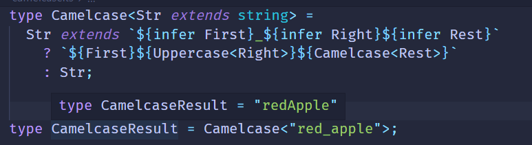
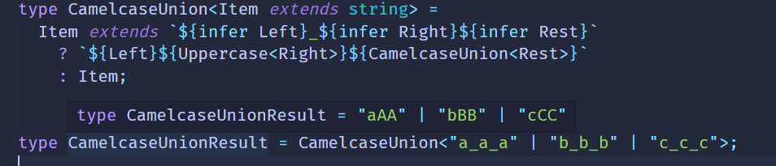
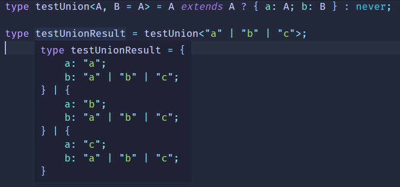
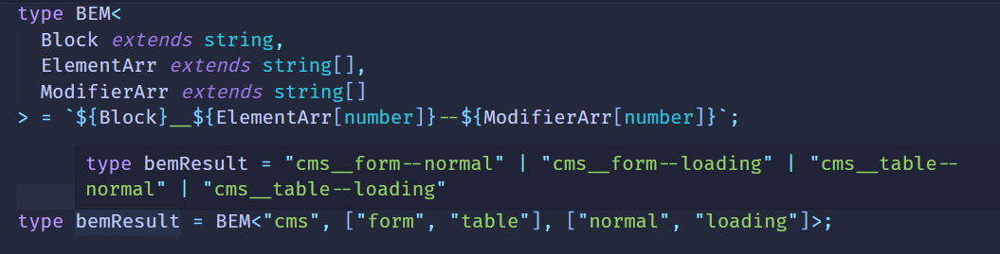

# 联合分散可简化

联合类型在TS类型编程中是比较特殊的，TypeScript对它做了专门的处理，写法上可以简化，也增加了认知成本。

#### 分布式条件类型

当类型参数为联合类型，并且在条件类型左边直接引用该类型参数时，TS会把每一个元素单独传入来做类型运算，

最后再合并成联合类型。

```ts
type Union = 'a' | 'b' | 'c';
```

我们想让其中的`a`大写:

```ts
type UppercaseA<Item extends string> = 
     Item extends 'a' ? Uppercase<Item> : Item;
type Result = UppercaseA<Union>// type Result = 'b' | 'c' | 'A';
```

这和联合类型遇到字符串时处理一样：

```ts
type str = `${Union}!` // type str = 'a!' | 'b!' | 'c!'
```

##### CamelcaseUnion

前面我们实现过`Camelcase`



也实现过`CamelcaseArr`

```ts
type CamelcaseArr<Arr extends string[], ResultArr extends string = []> = 
     Arr extends [infer First, ...infer Rest]
         ? [...Result, Camelcase<First & string>, ...CamelcaseArr<RestArr>]:
         : Result;
type CamelcaseArrResult = CamelcaseArr<['a_a_a', 'b_b_b', 'c_c_c']>;
// type CamelcaseArrResult = ['aAA', 'bBB', 'cCC'];
```

那么CamelcaseUnion怎么实现呢？



对Union的处理好像跟单个字符串处理没有区别？TS这样设计确实简化了很多，好像都是优点？

也不全是，接下来我们来看看这样设计的痛点。

##### IsUnion

判断联合类型我们会这样写：

```ts
type IsUnion<A, B = A> =
     A extends A
         ? [B] extends [A]
             ? false
             : true
         : never;
type IsUnionResult = IsUnion<'a' | 'b' | 'c' | 'd'> // true
type IsUnionResult2 = IsUnion<['a' | 'b' | 'c']> // false
```

为什么要这样写才能判断呢？

我们来写一个`testUnion`来测试一下:



**?  what  f&&k ?** 

A和B都是同一个联合类型为什么值还不一样呢？

这是因为条件类型中如果左边的值时联合类型，会把每个元素单独传入做计算，而右边不会。

所以当`A`是 `'a'`的时候，`B`是`'a' | 'b' | 'c'`,当`A`是 `'b'`的时候，`B`是`'a' | 'b' | 'c'`

利用这个特性：

- `A extends A`用来触发**分布式条件类型**，让A的每个类型单独传入。
- `[B] extends [A]`这样不直接写`B`就可以避免触发**分布式条件类型**，那么`B`就是整个联合类型。
- `B`是联合类型整体，而A是单个类型，判断自然不成立，而其他类型 `[A] extends [B]`肯定是成立的。

利用这个特性我们就可以判断出来是否是联合类型。

理解上述之后，我们再来做些练习

##### BEM

bem是css规范命名，用block__element--modifier的形式来描述某个区块下面的某个元素的某个状态的样式。

那么我们可以写一个这样的高级类型，传入block、element、modifier，返回构造出的class名。

```ts
type bemResult = BEM<'cms', ['form', 'table'], ['normal', 'loading']>;
```

它的实现就是三部分的合并，但传入的是数组，要递归遍历取出每一个元素来和其他部分组合，这样很麻烦。

而如果是联合类型就不用递归遍历了，因为联合类型遇到字符串也是会单独每个元素单独传入做处理。

数组转Union类型可以这样写：

```ts
type Union = ['apple', 'banana'][number];
// type Union = "apple" | "banana";
```

BEM的答案也呼之欲出了：



可以看到，用好了联合类型，可以简化类型编程逻辑。

##### AllCombinations

我们再来实现一个全组合的高级类型：

希望传入 `'A' | 'B'`的时候能够返回所有的组合`'A' | 'B' | 'AB' | 'BA'`

这种全组合问题的实现思路就是两两组合，组合出的字符串再跟其他字符串两两组合:

首先要实现一个两两组合：A 、 B 、AB 、BA

```ts
type Combination<A extends string, B extends string> = 
    | A
    | B
    | `${A}${B}`
    | `${B}${A}`;
```

然后将构造出来的字符串再和其他字符相结合

```ts
type AllCombinations<A extends string, B extends string = A> =
     A extends A 
       ? Combination<A, AllCombinations<Exclude<B, A>>>
       : never;   
```

