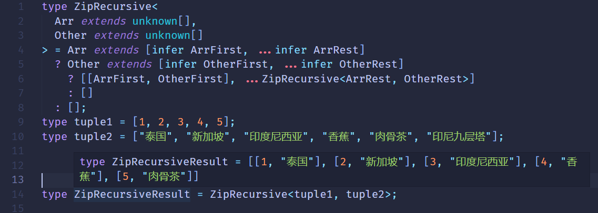

# 重新构造做变换

类型变成的主要目的就是对类型做各种转换,那么如何对类型做修改呢？

TS类型系统支持3中可以声明任意类型的变量 **type** 、**infer**、**类型参数**

type 叫类型别名，其实就是什么一个变量存储某个类型

```ts
type a = Promise<number>;
```

infer 用于变量提取，然后存到一个变量里面，相当于局部变量

```ts
type GetValueType = P extends Promise<infer Value> ? Value : never;
```

类型参数 用于接收具体的类型，在类型运算中也相当于局部变量

```ts
type isTwo<T> = T extends 2 ? true : false;
```

但是严格来说他们不能称之为变量，因为它们都不能重新赋值。

TS设计可以做类型编程的类型系统的目的就是为了产生各种复杂类型，那不能修改怎么产生新的类型呢？

答案是重新构造

### 重新构造

TS的**type** 、**infer**、**类型参数**声明的变量都不能修改，相对类型参数做各种变换产生新的类型就需要重新构造。

数组、字符串、函数等类型的重新构造比较简单。

索引类型，也就是多个元素的聚合类型的重新构造复杂移写，涉及到了映射类型的语法

#### 数组的重新构造

##### Push

有这样一个元组

```ts
type tuple = [1, 2, 3]
```

我想给这个元组再添加一些类型，怎么做呢？

TS类型变量不支持修改我们可以构造一个新的元组类型

```ts
type Push<Arr extends unknown[], Ele> = [...Arr, Ele];
type Push Result = Push<[1, 2, 3], 4>// type Push Result = [1, 2, 3, 4]
```

**数组跟元组的区别**：数组类型是指任意多个同一类型的元素构成的，比如number[]，Array<number>,而元组则是数量固定， 类型可以不同元素构成的， 比如[1, true, 'lcz'].

##### Unshift

同push

```ts
type unShift<Arr extends unknown[], Ele> = [Ele, ...Arr];
type unShiftResult = unShift<[2, 3, 4], 1> // type unShiftResult = [1, 2, 3, 4]
```

##### Zip

有这样两个元组：

```ts
type tuple1 = [1, 2];
type tuple2 = ['apple', 'banana'];
```

我们想让它们合并成这样的元组`[[1, 'apple'], [2, 'banana']]`

```ts
type Zip<Arr extends [unknown,unknown], Other extends [unknown,unknown]> = 
    Arr extends [infer ArrFirst, infer ArrSecond] ?
        Other extends [infer OtherFirst, infer OtherSecond] ?
            [[ArrFirst, OtherFirst], [ArrSecond, OtherSecond]]
        :[] 
    :[]
type ZipResult = Zip<tuple1, tuple2>// type ZipResult = [[1, 'apple'], [2, 'banana']]
```

但是这样只能完成数组为两个元素的合并，如果是多个呢？

那就的用递归了呢

```ts
type ZipRecursive<Arr extends unknown[], Other extends unknown[] > =
       Arr extends [infer ArrFirst, infer ArrRest] ?
        Other extends [infer OtherFirst, infer OtherRest] ?
            [[ArrFirst, OtherFirst], ...ZipRecursive<ArrRest, OtherRest>]
        :[] 
    :[]
```



##### 字符串类型的重新构造

我们想把一个字符串字面量类型的'apple'，转变成首字符大写的’Apple‘。

需要用到字符串类型的提取和重新构造

```ts
type CapitalizeStr <Str extends string> = 
     Str extends `${infer First}${infer Rest}` 
         ? `${Uppercase<First>}${Rest}` : Str 
```

我们声明了类型参数Str是要处理的字符串类型，通过extends约束为string。

通过infer提取出需要处理的首个字符为局部变量First，提取后面的字符到局部变量Rest。

然后通过TS内部提供的内置高级类型Uppercase把首字母大写，加上Rest，构造成新的字符串类型

```ts
type CapitalizeStrResult = CapitalizeStr<'apple'> // type  CapitalizeStrResult = 'Apple';
```

这就是字符串类型的重新构造：从已有的字符串中 提取出局部变量然后通过一系列变换，构造成新的字符串类型；

##### CamelCase

我们再来实现一个字符串的驼峰化 red_apple 转换成 redApple,同样需要用到递归的思想


##### DropSubStr

可以修改自然也可以删除，我们再来写一个删除一段字符串的案例：删除字符串中某个字符串

```ts
type DropSubStr<Str extends string, SubStr extends string> =
     Str extends `${infer Prefix}${infer SubStr}${infer Suffix}`
         ? `${Prefix}${Suffix}`
         : Str;
```

