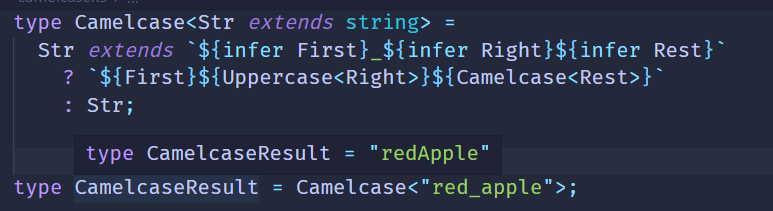

# 重新构造做变换

类型变成的主要目的就是对类型做各种转换,那么如何对类型做修改呢？

TS类型系统支持3中可以声明任意类型的变量 **type** 、**infer**、**类型参数**

type 叫类型别名，其实就是什么一个变量存储某个类型

```ts
type a = Promise<number>;
```

infer 用于变量提取，然后存到一个变量里面，相当于局部变量

```ts
type GetValueType = P extends Promise<infer Value> ? Value : never;
```

类型参数 用于接收具体的类型，在类型运算中也相当于局部变量

```ts
type isTwo<T> = T extends 2 ? true : false;
```

但是严格来说他们不能称之为变量，因为它们都不能重新赋值。

TS设计可以做类型编程的类型系统的目的就是为了产生各种复杂类型，那不能修改怎么产生新的类型呢？

答案是重新构造

### 重新构造

TS的**type** 、**infer**、**类型参数**声明的变量都不能修改，相对类型参数做各种变换产生新的类型就需要重新构造。

数组、字符串、函数等类型的重新构造比较简单。

索引类型，也就是多个元素的聚合类型的重新构造复杂移写，涉及到了映射类型的语法

#### 数组的重新构造

##### Push

有这样一个元组

```ts
type tuple = [1, 2, 3]
```

我想给这个元组再添加一些类型，怎么做呢？

TS类型变量不支持修改我们可以构造一个新的元组类型

```ts
type Push<Arr extends unknown[], Ele> = [...Arr, Ele];
type Push Result = Push<[1, 2, 3], 4>// type Push Result = [1, 2, 3, 4]
```

**数组跟元组的区别**：数组类型是指任意多个同一类型的元素构成的，比如number[]，Array<number>,而元组则是数量固定， 类型可以不同元素构成的， 比如[1, true, 'lcz'].

##### Unshift

同push

```ts
type unShift<Arr extends unknown[], Ele> = [Ele, ...Arr];
type unShiftResult = unShift<[2, 3, 4], 1> // type unShiftResult = [1, 2, 3, 4]
```

##### Zip

有这样两个元组：

```ts
type tuple1 = [1, 2];
type tuple2 = ['apple', 'banana'];
```

我们想让它们合并成这样的元组`[[1, 'apple'], [2, 'banana']]`

```ts
type Zip<Arr extends [unknown,unknown], Other extends [unknown,unknown]> = 
    Arr extends [infer ArrFirst, infer ArrSecond] ?
        Other extends [infer OtherFirst, infer OtherSecond] ?
            [[ArrFirst, OtherFirst], [ArrSecond, OtherSecond]]
        :[] 
    :[]
type ZipResult = Zip<tuple1, tuple2>// type ZipResult = [[1, 'apple'], [2, 'banana']]
```

但是这样只能完成数组为两个元素的合并，如果是多个呢？

那就的用递归了呢

```ts
type ZipRecursive<Arr extends unknown[], Other extends unknown[] > =
       Arr extends [infer ArrFirst, infer ArrRest] ?
        Other extends [infer OtherFirst, infer OtherRest] ?
            [[ArrFirst, OtherFirst], ...ZipRecursive<ArrRest, OtherRest>]
        :[] 
    :[]
```


##### 字符串类型的重新构造

我们想把一个字符串字面量类型的'apple'，转变成首字符大写的’Apple‘。

需要用到字符串类型的提取和重新构造

```ts
type CapitalizeStr <Str extends string> = 
     Str extends `${infer First}${infer Rest}` 
         ? `${Uppercase<First>}${Rest}` : Str 
```

我们声明了类型参数Str是要处理的字符串类型，通过extends约束为string。

通过infer提取出需要处理的首个字符为局部变量First，提取后面的字符到局部变量Rest。

然后通过TS内部提供的内置高级类型Uppercase把首字母大写，加上Rest，构造成新的字符串类型

```ts
type CapitalizeStrResult = CapitalizeStr<'apple'> // type  CapitalizeStrResult = 'Apple';
```

这就是字符串类型的重新构造：从已有的字符串中 提取出局部变量然后通过一系列变换，构造成新的字符串类型；

##### CamelCase

我们再来实现一个字符串的驼峰化 red_apple 转换成 redApple,同样需要用到递归的思想



##### DropSubStr

可以修改自然也可以删除，我们再来写一个删除一段字符串的案例：删除字符串中某个字符串


#### 函数类型的重新构造

##### AppendArgument

之前我们分别实现了参数和返回值的提取，那么重新构造就是用这些提取出来的类型坐下修改，构造一个新的类型即可。

```ts
type AppendArgument<Func extends Function,Arg> = 
     Func extends (...args: infer Args) => infer ReturnType
          ? (...args:[...Args,Arg]) => ReturnType : never;
```

类型参数Func是要处理的函数类型，通过extends约束为Function，Arg是要添加的参数类型。

通过模式匹配提取参数infer到局部变量Args，提取返回值infer到局部便改良ReturnType中，用Args数组添加Arg构造成新的函数类型，

ReturnType构造成新的函数类型返回。

```ts
type AppendArgumentResult = AppendArgument<(name: string) => boolean, number> 
// type AppendArgumentResult = (args_0: string, args_1: number) => boolean
```

#### 索引类型的重新构造

索引类型是聚合多个元素的类型，比如这就是一个索引类型：

```ts
type obj = {
   name:string;
   age:number;
   gender:boolean
}
```

索引类型可以添加修饰符readonly（只读）、？(可选)：

```ts
type obj = {
   readonly name:string;
   age?:number;
   gender:boolean
}
```

对它的类型重新构造涉及到了映射类型的语法：

```ts
type Mapping<obj extends object> =
 [Key in keyof Obj]: Obj[Key]
```

##### Mapping

映射过程中可以对value进行修改：

```ts
type Mapping<obj extends object> =
 [Key in keyof Obj]: [Obj[Key], Obj[Key], Obj[Key],]
```


##### UppercaseKey

除了可以对Value进行修改，也可以对Key进行修改，使用as，这叫做`重映射`

比如把索引的Key变为大写。

```ts
type UppercaseKey<Obj extends Object> = {
    [Key in keyof Obj] as Uppercase<Key & string>: Obj[Key]
}
type UppercaseKeyReulst = UppercaseKey<{a:1; b: 2}>
```

参数类型Obj是待处理的索引，也就是 Key in keyof Obj，但要做一些变换就是as之后的。

因为索引的类型可以为string、number、symbol，而这里只能接收string类型，所以要&string，也就是取索引中的string部分。

value保持不变，也就是之前的索引Key对应的值的类型Obj[Key]

##### Record

TypeScript提供了内置的高级类型Record来创建索引类型：

```ts
type Record<K extends string| number| symbol, T> = {[P in K] : T; } 
```

指定索引的值和类型分别为K 和 T，就可以创建一个对应的索引类型.

上面索引类型的约束我们用的object，其实更语义化一点推荐使用`Record<string,object>`

```ts
type UppercaseKey<Obj extends Record<string, any>> = {
    [Key in keyof Obj] as Uppercase<Key & string>: Obj[Key]
}
```

也就是约束为类型参数Obj为key为string，值为任意类型的索引类型。

ToReadonly

索引类型的索引可以添加readonly的修饰符，代表只读。

可以实现给索引类型添加readonly修饰的高级类型：

```ts
type ToReadonly<T> = {
    readonly [Key in keyof T]: T[Key]
}
type ToReadonlyResult = ToReadonly<{name: string;age: number}>
// type ToReadonlyResult = {readonly name: string;readonly age: number}
```

通过映射类型构造了新的索引类型，给索引加上了readongly修饰，其余保持不变，索引依然为原来的 `Key in keyof T`,值依然为原来的`T[Key]`

##### ToPartial

同理，索引类型还可以添加可选修饰符。

```ts
type ToPartial<T> = {
    [Key in keyof T] ?: T[Key] 
}
type ToPartialResult = ToPartial<{name: string;age: number}>
// type ToPartialResult = { name?: string | undefined; age?: number | undefined}
```

##### ToMutable

可以添加readonly修饰符自然也可以去掉：

```ts
type ToMutable<T> = {
   -readonly [Key in keyof T]: T[Key]
}
type ToMutableResult = ToMutable<{readonly name: string;readonly age: number}>
// type ToMutableResult = {name: string;age: number}
```

##### ToRequired

同理也可以去掉可选修饰符：

```ts
type ToRequired<T> = {
    [Key in keyof T]-? : T[Key]
}
type ToRequiredResult = ToRequired<{ name?: string ; age?: number}>
// type ToRequiredResult = {name: string;age: number}
```

##### FilterByValueType

可以再构造索引类型的时候根据值的类型做过滤：

```ts
type FilterByValueType<
    Obj extends Record<string, any>,
    ValueType
> = {
    [Key in keyof Obj 
       as ValueType extends Obj[Key] ? Key : never] 
       : Obj[Key] 
}
type FilterByValueTypeResult = FilterByValueType<{
    name: string; age: number; gender: boolean
    }, 
    string|number>;
// type FilterByValueTypeResult = {name: string; age: number}
```

参数类型Obj为要处理的索引类型，通过extends约束为索引为string，值为任意类型的索引类型`Record<string, any>`

类型参数ValueType为要过滤出的索引类型。

构造新的索引类型，索引为新的索引也就是`Key in keyof Obj `,但是要经过as变换。

如果原来索引的值Obj[Key]是ValueType类型，索引依然为之前的索引，否则就never掉，never的索引会在生成新索引类型时被去掉

值保持不变。